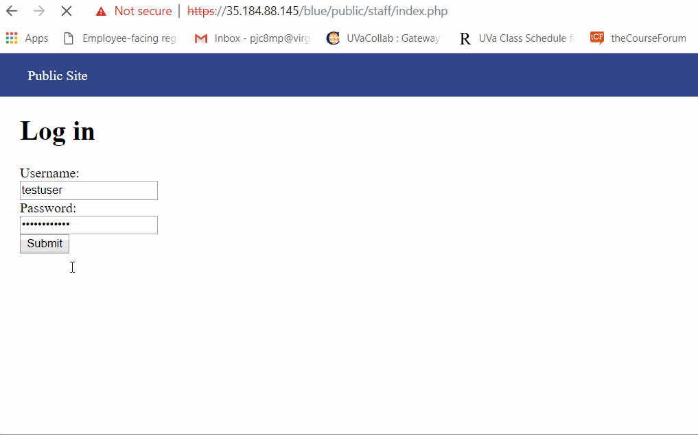
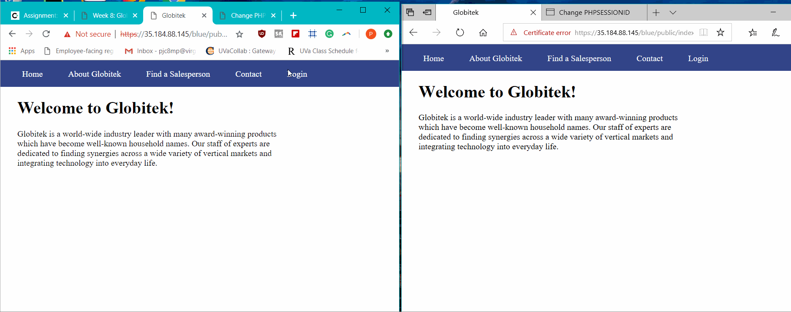
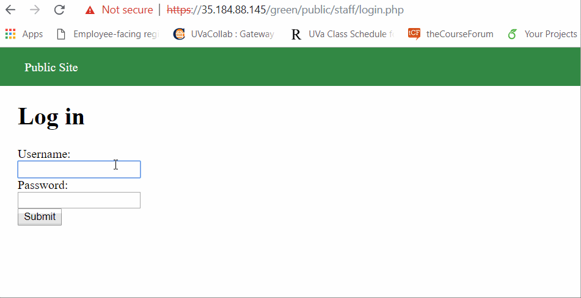
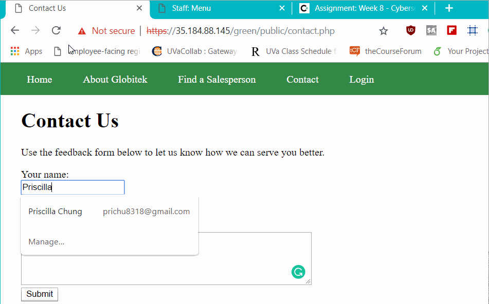
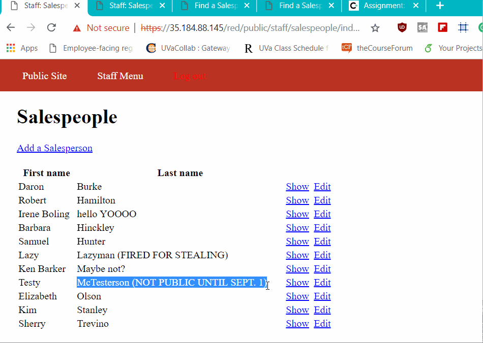
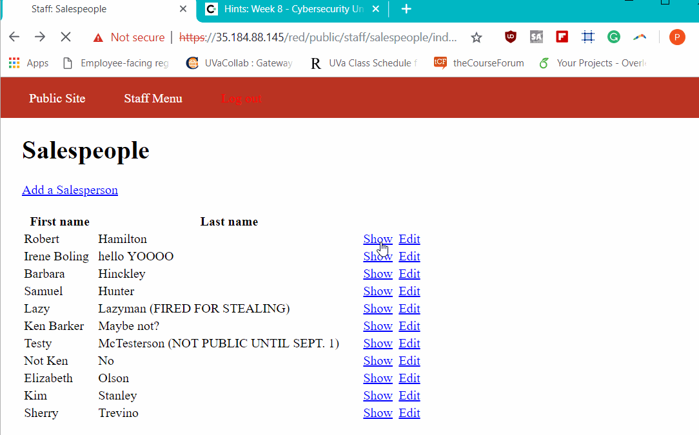

# CodePath-Week-8

# Project 8 - Pentesting Live Targets

Time spent: 8 hours spent in total

> Objective: Identify vulnerabilities in three different versions of the Globitek website: blue, green, and red.

The six possible exploits are:
* Username Enumeration
* Insecure Direct Object Reference (IDOR)
* SQL Injection (SQLi)
* Cross-Site Scripting (XSS)
* Cross-Site Request Forgery (CSRF)
* Session Hijacking/Fixation

Each version of the site has been given two of the six vulnerabilities. (In other words, all six of the exploits should be assignable to one of the sites.)

## Blue

Vulnerability #1: SQL Injection (SQLi)
On the salesperson page, when you look through all the employee's page in the URL you notice how they all have id=__ . By replacing the ___ with ' OR SLEEP(5)=0--'. The URL's ending changes to %27%20OR%20SLEEP(5)=0--%27. The page then refreshes for a couple of seconds than loads to Daron Burke. 

Vulnerability #2: Session Hijacking/Fixation
In one browser open up Blue website and log in. Also open up PHP script,change session id given to us by CodePath, and copy the session id. Open up another browser to a Blue website that is not logged in, and open up the PHP script for it. Insert in the logged in website session id into the second browser (which is the website that is not logged in). Click the Log in page, and you should be logged in to the website without having to insert in your username and password. 

## Green

Vulnerability #1: User Enumeration
We know that jmonroe99 and pperson are valid usernames and if you incorrectly type the password you receive an error message "Log in was unsuccessful" is bolded. However, when you try to submit in a username that is not valid like uname the error message is not bolded. 

Vulnerability #2: Cross-Site Scripting (XSS)
First you send in a Contact US reqest form with a random name and email in the correct format, then in the comment box enter in a script that can potentionally give the admin an virus when they check for any feedback. 

## Red

Vulnerability #1: Insecure Direct Object Reference (IDOR)
When looking at the Find a Salesperson page, we are able to access a different's salesperson whose information is not public by manipulating the url and changing the id number. 

Vulnerability #2: Cross-Site Request Forgery (CSRF)
We can trick the admin into opening a blank page in the feedback that contains a hidden malicious link.

## Notes

Describe any challenges encountered while doing the work:
  Someone had changed the username and password so you couldn't log to any of the websites(Mirror1 and Mirror2). I had to log in through   a different account that someone else had made
